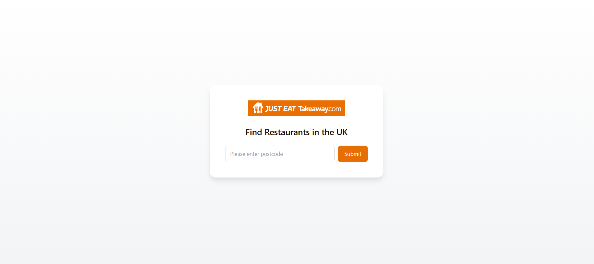
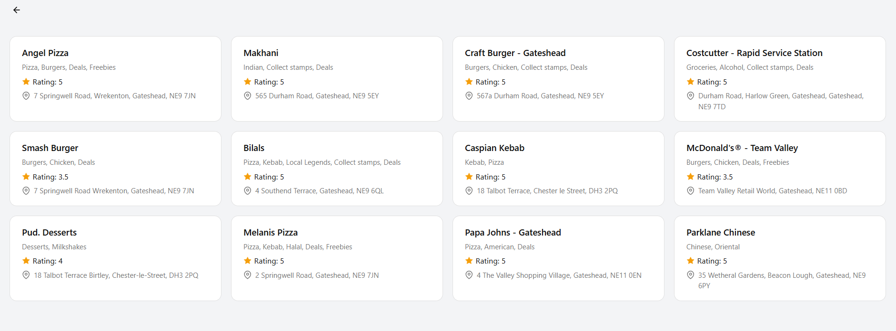
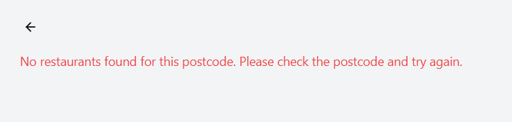
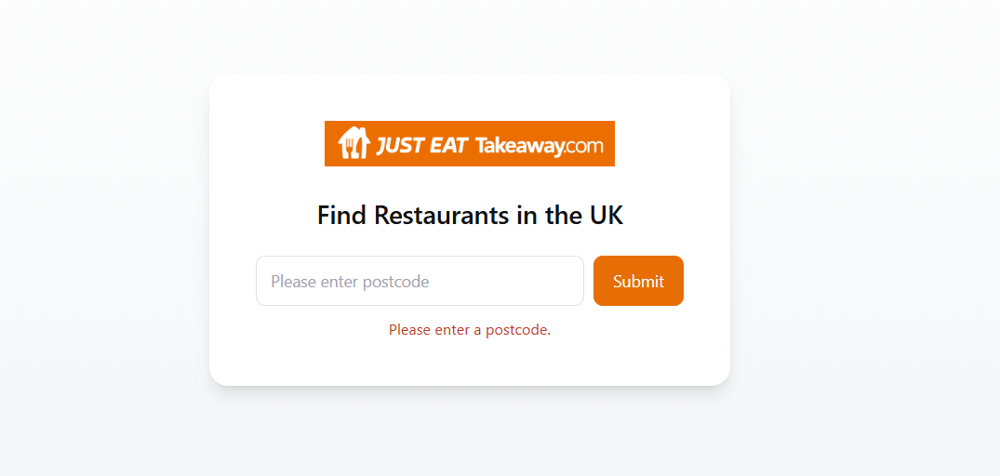

# JustEatTakeaway_Assessment

## Description

A Spring Boot REST API application for restaurant listing. This project provides endpoints to retrieve restaurant information using the Just Eat API, with a simple frontend for searching restaurants by UK postcode.

## Prerequisites

- **Java 17** or higher
- **Maven 3.8** or higher

To verify installations:

```bash
java -version
mvn -version
```

## Project Structure

```
src/
├── main/
│   ├── java/com/example/restaurant/
│   │   ├── Application.java                  (Main Spring Boot application)
│   │   ├── controller/
│   │   │   ├── RestaurantApiController.java   (REST endpoint for restaurant search)
│   │   │   └── WelcomeController.java         (Home page controller)
│   │   ├── model/
│   │   │   └── Restaurant.java                (Data model with Address, Rating, Cuisine)
│   │   └── service/
│   │       └── RestaurantService.java         (Fetches data from Just Eat API)
│   └── resources/
│       ├── application.yml                    (Configuration file)
│       └── static/
│           ├── index.html                     (Search page)
│           ├── restaurants.html               (Results page)
│           └── restaurants.js                 (Frontend logic)
└── test/
    └── java/com/example/restaurant/
        └── service/
            └── RestaurantServiceTest.java     (Unit tests for RestaurantService)
```

## How to Build, Compile and Run

### 1. Clone the repository

```bash
git clone https://github.com/VINISHA07/JustEatTakeaway_Assessment.git
```

Or clone [this repo](https://github.com/VINISHA07/JustEatTakeaway_Assessment.git) directly.

### 2. Build and compile

```bash
mvn clean package
```

This compiles the source code, runs all unit tests, and generates an executable JAR file in the `target/` directory.

To compile without running tests:

```bash
mvn clean package -DskipTests
```

### 3. Run the application

**Option A: Using Maven (recommended for development)**

```bash
mvn spring-boot:run
```

**Option B: Using the standalone JAR**

```bash
java -jar target/restaurant-api-0.0.1-SNAPSHOT.jar
```

### 4. Access the application

Once running, open your browser and navigate to:

- **Frontend**: `http://localhost:8080` - enter a UK postcode to search for restaurants
- **API directly**: `http://localhost:8080/api/restaurants/bypostcode/{postcode}` (e.g. `/api/restaurants/bypostcode/EC4M7RF`)

### 5. Run tests

```bash
mvn test
```

## API Endpoints

### Just Eat Restaurants API

- `GET /api/restaurants/bypostcode/{postcode}` - Fetch restaurants by postcode
  - Example: `/api/restaurants/bypostcode/L4%200TH`
  - Returns: JSON array with restaurant data including name, address, rating, and cuisines

### Health & Info (Actuator)

- `GET /actuator/health` - Application health status
- `GET /actuator/info` - Application information

## Configuration

Application settings are defined in `src/main/resources/application.yml`:

- **Server Port**: 8080
- **Logging Level**: INFO (root), DEBUG (com.example)
- **Actuator Endpoints**: health, info

## Design & Architecture

- **Layered architecture** - The application follows a clean Controller → Service → Model separation. The controller handles HTTP concerns, the service encapsulates business logic and external API calls, and the model defines the data structure.
- **Thin controller** - `RestaurantApiController` acts as a passthrough layer, delegating all logic to `RestaurantService` to keep the controller focused on request/response handling.
- **External API integration** - `RestaurantService` uses Spring's `RestTemplate` to call the Just Eat discovery API and Jackson's `ObjectMapper` to deserialise only the fields we need, ignoring everything else.
- **Static frontend** - The UI is a pair of plain HTML pages (`index.html` for search, `restaurants.html` for results) served directly by Spring Boot's static resource handling, with no frontend build step required.
- **Decoupled frontend/backend** - The frontend communicates with the backend via a REST API (`/api/restaurants/bypostcode/{postcode}`), keeping the two layers independent and making it easy to swap out either side.
- **Testability** - The service layer is tested in isolation using Mockito to mock `RestTemplate`, allowing unit tests to run without hitting the real external API.

## Assumptions

- **UK postcodes only** - The Just Eat API endpoint used is specific to the UK (`uk.api.just-eat.io`). The application does not validate postcode format; it passes the user input directly to the API.
- **Result limit of 12** - The service returns a maximum of 12 restaurants per search. This was chosen over 10 for a more well-rounded grid display, as 10 felt visually incomplete on a 4-column layout.
- **No authentication required** - The Just Eat discovery API is assumed to be publicly accessible without API keys or tokens.
- **Cuisines include non-food tags** - The Just Eat API returns values like "Deals", "Freebies", "Collect stamps" etc. under the cuisines field. These are not actual cuisines but are treated as such since they come from the same field in the API response.

## Improvements

### UX Improvements

- **Restaurant images** - If the API response contains an image URL for a restaurant, display it in the card to make the results more visually appealing.
- **Filtering** - Allow users to filter results by rating, cuisine type, distance from postcode, or restaurants offering deals.
- **Sorting** - Allow users to sort results by rating, distance, or other criteria.
- **Lazy loading** - Implement infinite scroll so restaurant cards load incrementally as the user scrolls down, rather than rendering all results at once.
- **Loading spinner** - Add a loading spinner while fetching results to provide visual feedback to the user.

### Technical Improvements

- **Postcode validation** - Add server-side validation of UK postcode format before calling the external API to fail fast on invalid input.
- **Caching** - Introduce caching (e.g. Spring Cache with a TTL) to reduce redundant calls to the Just Eat API for the same postcode.
- **Rate limiting** - Add rate limiting to prevent abuse and protect the upstream Just Eat API.

## Technologies Used

- **Spring Boot**: 3.3.0
- **Java**: 17
- **Build Tool**: Maven
- **Lombok**: Annotation-based boilerplate reduction
- **Tailwind CSS**: Utility-first CSS (via CDN) for frontend styling
- **Configuration Format**: YAML

## Interface images

### Home Screen



### Restaurant list display



### Empty restaurant list (Incorrect pincode/Fetch error)



### Empty postcode


